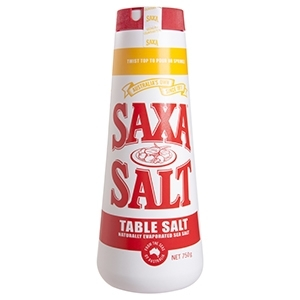
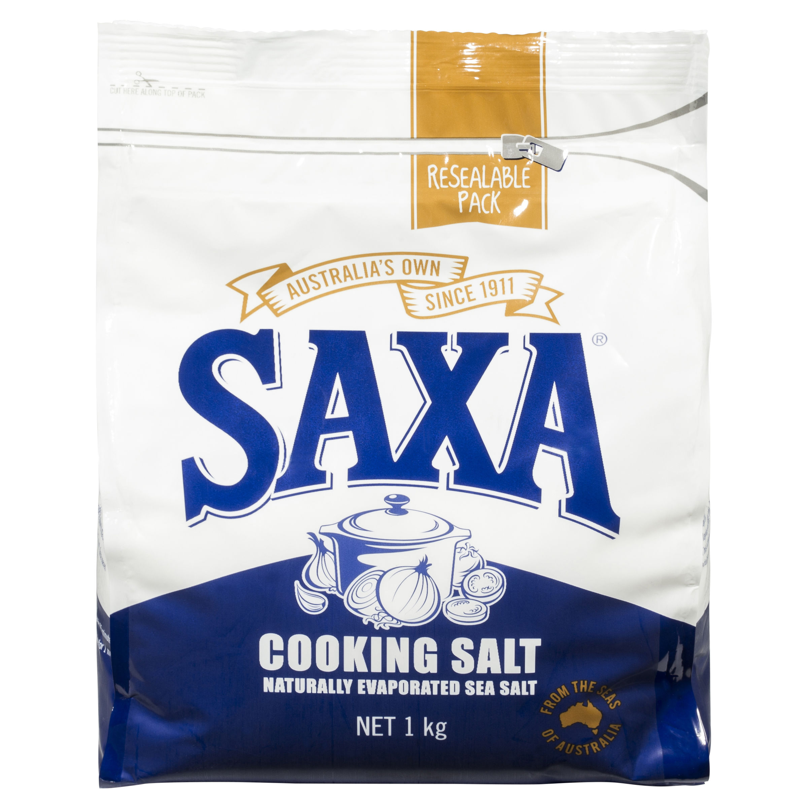
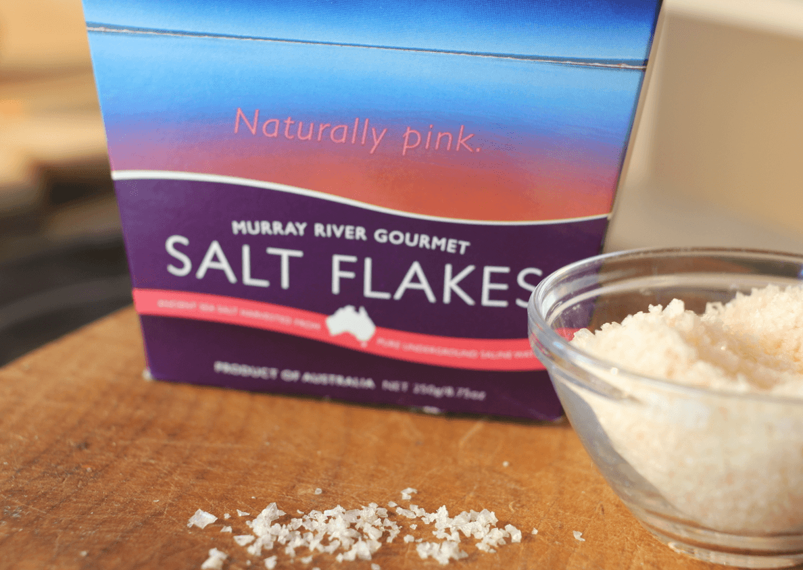

<h4>In summary...</h4>

Use cooking salt (Kosher in USA) in recipes and table salt at the table.

Head across the oceans of the SS Recip-internet and you might end up a bit salty. What does
all this flake this, crystal that, fine ground this, iodised that mean? Kosher? Why are all
american recipes replete with recommendations about conforming to the kashrut? Isn't salt just tiny rocks that make food better?

There are a couple clarifying rules that can be used to cut through the noise;

1. Different types of salt are most importantly different in terms of the size of the salt
granules.
2. If something has been added to the salt, it's purely for flavour or general populace
health reasons.

## Table

Sometimes tables are IN kitchens, which can make this salt *very* confusing. The rule is simple,
if you're cooking the meal, don't use table salt. It's fine grained and doesn't have any really useful properties aside from rapid flavour concentration. Because its grains are so small, when measuring for cooking only a small deviation in the measurement of the salt can affect the flavour of the entire dish too much. After cooking, if one elects to add salt, use this as its cheapest and most available.

## Kosher/Cooking Salt

Kosher/Cooking salt has much larger granules than table salt. Logically this
means use of the product means much more consistent measurement, but it has other
useful properties. The larger granules hold onto moisture and therefore hold more
moisture as the brining process takes place.

For all meat dry brining, kosher salt should be used. If you tried using table
salt to brine chicken for frying for example, the moisture would all be pulled
out and you'd end up with dry bird!

### Sea Salt Flakes

Sea flakes can be used in place of cooking salt at a pinch, or as crunchy
finishers that aren't as heavy as putting whole crystals onto food. They m

## Iodised/Chemicals added to salt
In Australia, a lot of salt used at the manufacturing level has has iodine
added to it. This is similar to adding fluoride to toothpaste, it's something to prevent iodine deficient brain damange from occuring at the country level. You won't often find iodized cooking salt, but the jury is out as to how much it affects the flavour of what you're cooking. Worth trying yourself as iodized salt is certainly better for you!

## Crystals
Crystals are only really useful for baking (salted caramel etc) or applications
where the crunchiness of the salt is important. I never use them myself, and if I did I'd put them in a grinder anyway which would result in table salt.

## Grinding yoself
There is no advantage to grinding salt 'fresh' as there is for pepper, but it
is often the case you see grinders used. That's fine! Aesthetics are important too.
